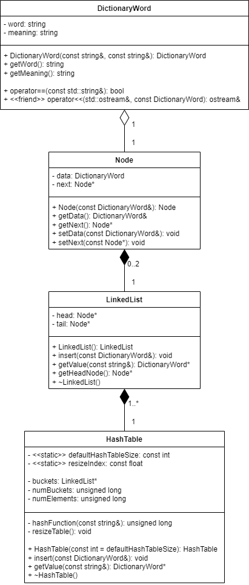

# DictionaryReader
C++ program for reading dictionary files and printing the meaning of the words. The default dictionary file is dict_processed.txt inside the "Dictionary reader" folder. Program use a hash table with a default size of 1000 buckets. The hash table is expanded twice and rebuilt when the number of added values exceeds 80% of the number of buckets in the table. A linked list was used to avoid collisions.

Dictionary file format: WORD,MEANING

## UML class diagram

